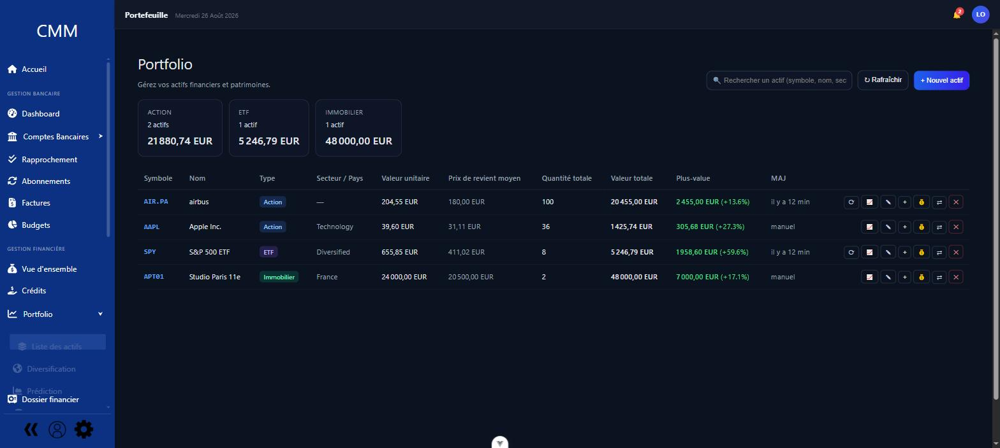
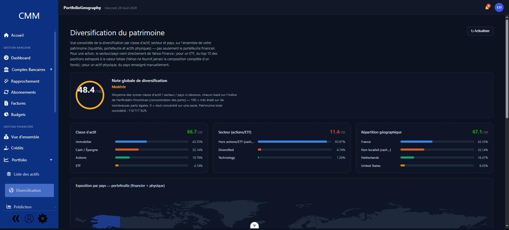
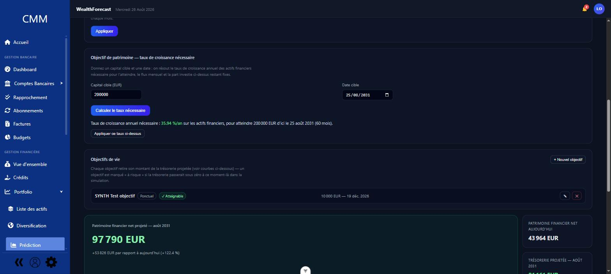
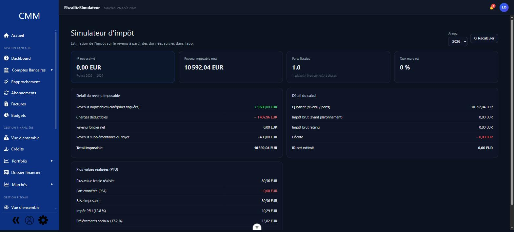

# CMM — Cantisa Money Manager

Une application de gestion financière personnelle **complète et auto-hébergée** : comptabilité en
partie double façon GnuCash, budgets, crédits, portefeuille d'investissement, patrimoine et
fiscalité — dans une interface pensée par sections dédiées (à la Microsoft Money) plutôt qu'un
empilement d'onglets. Vos données restent chez vous, sur votre propre serveur.


## Pourquoi CMM

- **100 % auto-hébergé, zéro dépendance cloud** — vos comptes, soldes et transactions ne quittent
  jamais votre machine. Pas d'abonnement, pas de service tiers qui ferme et emporte vos données.
- **Comptabilité en partie double, pas un simple pointeur de dépenses** — chaque transaction est
  un ensemble de splits qui s'équilibrent, comme un vrai grand livre comptable (GnuCash). Ça
  élimine toute une classe d'incohérences que les apps "liste de dépenses" ne détectent jamais.
- **Tout au même endroit** — comptes bancaires, budgets, crédits, portefeuille d'investissement,
  immobilier et impôts sont généralement éclatés entre 3 ou 4 apps différentes. Ici, un seul
  patrimoine consolidé, une seule source de vérité.
- **Multi-devises natif** — comptes et actifs dans n'importe quelle devise, conversion automatique
  au taux du jour (ou historique) partout où c'est pertinent.
- **Fiscalité française intégrée** — un moteur de calcul d'impôt sur le revenu configurable
  (foyer fiscal, quotient familial, marquage fiscal des catégories) directement branché sur les
  données déjà suivies dans l'app, sans re-saisie dans un tableur à part.
- **Vos données, exportables à tout moment** — sauvegarde/restauration complète, exports PDF/CSV :
  aucun verrouillage propriétaire.
- **Code source ouvert** — l'app tourne en Docker en une commande, et le schéma de données comme
  la logique de calcul sont entièrement lisibles et modifiables.

## Fonctionnalités

### Vue d'ensemble et suivi au quotidien
Tableau de bord avec évolution du patrimoine net, solde et dépenses par catégorie ; page d'accueil
centralisant échéances à venir (abonnements, crédits) et santé budgétaire.

<p>
  
</p>

### Comptabilité en partie double, multi-devises
Comptes de tous types (courant, actif, passif, capitaux propres, revenus, dépenses), transactions
à splits multiples, rapprochement bancaire, synchronisation bancaire (Enable Banking), import CSV
avec catégorisation par règles, OCR de factures avec auto-création de transactions.

### Budgets, abonnements, crédits
Budgets par compte/catégorie/tag avec suivi automatique des dépenses, abonnements récurrents avec
alertes avant prélèvement et historique de prix, crédits avec échéanciers, révisions de taux et
remboursement anticipé.

### Portefeuille d'investissement et patrimoine
Suivi d'actifs (actions, ETF, immobilier, véhicules...) avec cours de marché en temps réel,
opérations sur titres (split, fusion, scission), DCA (plans d'investissement programmé), et une vue
consolidée du patrimoine total.

<p>
  
</p>

### Diversification et prédiction du patrimoine
Portail de diversification donnant une note globale (indice de Herfindahl-Hirschman) et la
répartition par classe d'actif, secteur et pays — sur l'ensemble du patrimoine, pas seulement le
portefeuille financier. Projection du patrimoine net à horizon choisi, avec un calculateur d'objectif
qui résout le taux de croissance annuel nécessaire pour atteindre un capital cible à une date donnée.

<p>
  
  
</p>
<p>
  
</p>

### Fiscalité, rapports et sauvegarde
Moteur d'impôt sur le revenu configurable (foyer fiscal, quotient familial, plus-values), 
constructeur de rapports personnalisés, export PDF/CSV, coffre-fort de documents financiers, et
sauvegarde/restauration complète des données.

<p>
  
</p>

## Installation rapide (Docker)

Prérequis : Docker + Docker Compose.

```bash
docker compose up --build
```

Accès : **https://localhost** (certificat auto-signé par défaut — accepter l'avertissement du
navigateur une fois).

Un seul conteneur est exposé, `caddy` (reverse proxy) : il sert le frontend et route `/api/*` vers
le backend. `db`, `backend` et `frontend` ne sont accessibles que sur le réseau Docker interne.

Comptes de démonstration créés au premier démarrage (base vide) : `John` / `Alice`, mot de passe
`CantisaDemo2026!` pour les deux.

Copier `.env.example` en `.env` à la racine pour personnaliser le déploiement (tout est optionnel,
des valeurs par défaut raisonnables s'appliquent sinon) :
- `FLASK_SECRET_KEY` / `PWD_PEPPER` / `POSTGRES_PASSWORD` — laisser vide : des valeurs aléatoires
  sont générées automatiquement et persistées ; à ne définir que pour imposer une valeur précise
- `RESET_DB_ON_START=true` — repart d'une base vide + démo à chaque redémarrage (au lieu de
  conserver les données)
- `DEMO_DATA=false` — base vide sans jeu de données de test ; combiné à `ADMIN_USERNAME` /
  `ADMIN_EMAIL` / `ADMIN_PASSWORD`, crée un unique compte admin réel à la place (sinon aucun moyen
  de se connecter, il n'y a pas d'inscription publique)
- `HTTP_PORT` / `HTTPS_PORT` — ports publics du reverse proxy (défauts `80` / `443`)
- `MAX_UPLOAD_MB` — taille max d'un upload (défaut `500`)

### Exposer l'app sur un domaine

Le frontend appelle l'API en relatif : **changer l'adresse publique ne nécessite pas de rebuild**.
Selon le certificat voulu (voir `.env`) :

| Cas | Configuration |
|---|---|
| LAN / usage perso | rien à faire — certificat auto-signé, `https://<ip-ou-hôte>` |
| Certificat existant (ex. Let's Encrypt géré ailleurs) | `TLS_CERT_PATH` / `TLS_KEY_PATH` + monter le dossier dans le service `caddy` |
| Certificat public automatique | `EDGE_ACME_DOMAIN=mon-domaine.fr` (le domaine doit pointer ici, ports 80+443 ouverts) |
| Derrière ton propre reverse proxy | `EDGE_HTTPS=false` — `caddy` sert en HTTP, ton proxy termine le TLS et forwarde dessus. Mettre `JWT_COOKIE_SECURE=false` seulement si le lien ton-proxy → caddy n'est pas en HTTPS |

Le trafic interne (`caddy` → backend/frontend) est toujours chiffré (certificat auto-signé non
vérifié — réseau Docker isolé).

### Migrations

Le schéma est géré par Alembic (`backend/migrations/`). `docker compose up` applique
automatiquement les migrations en attente à chaque démarrage (idempotent, ne touche à rien si
déjà à jour). Après une modification des modèles SQLAlchemy :
```bash
cd backend
alembic revision --autogenerate -m "description du changement"
```
Puis relire le fichier généré dans `migrations/versions/` avant de le committer — l'autogenerate
ne détecte pas tout correctement (renommages de colonnes, etc.).

## Installation manuelle (sans Docker) — développement

Backend :
```bash
cd backend
pip install -r requirements.txt
python app.py
```
Nécessite un PostgreSQL accessible (variables `DB_*` du même `.env.example` que ci-dessus — le
backend le retrouve tout seul même lancé depuis `backend/`) et le moteur Tesseract OCR installé
sur la machine (utilisé par la fonctionnalité Factures).

Frontend :
```bash
npm install
npm run dev
```
Le serveur de dev Vite proxifie `/api` vers le backend (`localhost:5000`) : le frontend est en
same-origin, comme derrière le reverse proxy en prod. `API_HTTPS=true` dans `.env` sert le dev en
HTTPS (démarrer le backend une fois d'abord, il génère le certificat).

Un déploiement bare-metal *de production* (build statique + gunicorn en service systemd + nginx
hôte) n'est pas encore fourni — utiliser Docker pour la prod.
