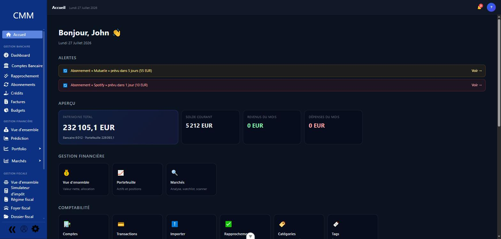
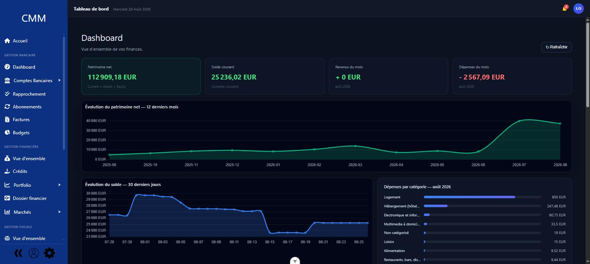
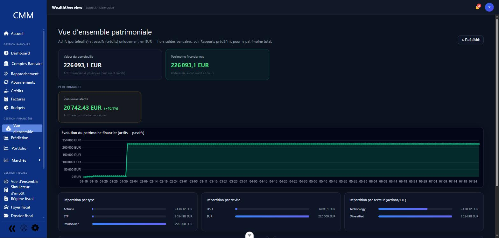
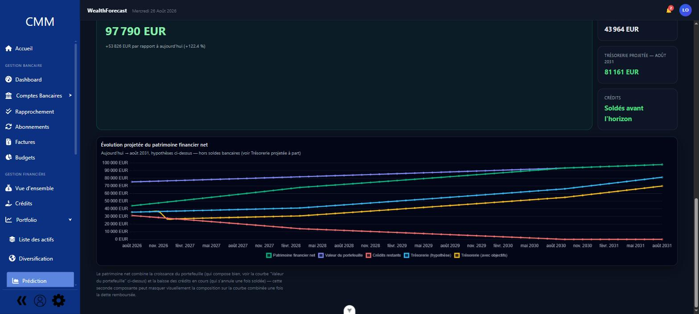

# CMM — Cantisa Money Manager

Une application de gestion financière personnelle complète et auto-hébergée : comptabilité en
partie double façon GnuCash, budgets, crédits, patrimoine et fiscalité, dans une interface web
pensée par sections dédiées (à la Microsoft Money) plutôt qu'un empilement d'onglets.



<p>
  
  
  
</p>

Backend Flask (Python) + PostgreSQL, frontend Vue 3 + Vite.

## Fonctionnalités

**Comptabilité en partie double, multi-devises**
Comptes de tous types (courant, actif, passif, capitaux propres, revenus, dépenses), transactions
à splits multiples, rapprochement bancaire, devises et taux de change avec conversion automatique.

**Budgets, abonnements, crédits**
Budgets par compte/catégorie/tag avec suivi automatique des dépenses, abonnements récurrents avec
alertes avant prélèvement, crédits avec échéanciers, révisions de taux et remboursement anticipé.

**Patrimoine, portefeuille, prédiction**
Suivi d'actifs avec historique de valorisation, portefeuille avec cours de marché, projection du
patrimoine net dans le temps.

**OCR, import intelligent, fiscalité, rapports**
Scan de factures avec auto-création de transactions, import bancaire CSV avec catégorisation en
masse, moteur d'impôt configurable (foyer fiscal, marquage fiscal des catégories), constructeur de
rapports personnalisés, export PDF/CSV et sauvegarde/restauration complète des données.

## Installation rapide (Docker)

Prérequis : Docker + Docker Compose.

```bash
docker compose up --build
```

- Frontend : http://localhost:5173
- Backend : http://localhost:5000

(ports par défaut — personnalisables via `FRONTEND_PORT`/`API_PORT`, voir plus bas)

Comptes de démonstration créés au premier démarrage (base vide) : `John` / `Alice`, mot de passe
`CantisaDemo2026!` pour les deux.

Copier `.env.example` en `.env` à la racine pour personnaliser le déploiement (tout est optionnel,
des valeurs par défaut raisonnables s'appliquent sinon) :
- `ANTHROPIC_API_KEY` — active la catégorisation par IA
- `FLASK_SECRET_KEY` / `PWD_PEPPER` / `POSTGRES_PASSWORD` — laisser vide : des valeurs aléatoires
  sont générées automatiquement et persistées ; à ne définir que pour imposer une valeur précise
- `RESET_DB_ON_START=true` — repart d'une base vide + démo à chaque redémarrage (au lieu de
  conserver les données)
- `DEMO_DATA=false` — base vide sans jeu de données de test ; combiné à `ADMIN_USERNAME` /
  `ADMIN_EMAIL` / `ADMIN_PASSWORD`, crée un unique compte admin réel à la place (sinon aucun moyen
  de se connecter, il n'y a pas d'inscription publique)
- `CORS_ORIGINS` — origine(s) autorisées à appeler l'API, si le frontend n'est pas sur
  `localhost:5173`
- `API_HOST` / `API_PORT` / `FRONTEND_PORT` / `POSTGRES_PORT` — pour un accès depuis un autre
  appareil que la machine hôte, ou en cas de port déjà pris. `API_HOST`/`API_PORT`/`API_HTTPS` sont
  figées dans le frontend au moment du build (`docker compose up --build` nécessaire pour les
  changer, un simple redémarrage ne suffit pas)
- `API_HTTPS=true` — sert l'API **et** le frontend en HTTPS, avec le même certificat auto-signé
  généré automatiquement (si `TLS_CERT_PATH`/`TLS_KEY_PATH` ne sont pas fournis) ; pas de reverse
  proxy dans ce projet, chaque service termine TLS lui-même (gunicorn, nginx/Vite). Suit aussi
  `JWT_COOKIE_SECURE` par défaut (pas besoin de définir les deux séparément) ; penser à adapter
  `CORS_ORIGINS` en `https://` également

### Migrations

Le schéma est géré par Alembic (`backend/migrations/`). `docker compose up` applique
automatiquement les migrations en attente à chaque démarrage (idempotent, ne touche à rien si
déjà à jour). Après une modification des modèles SQLAlchemy :
```bash
cd backend
alembic revision --autogenerate -m "description du changement"
```
Puis relire le fichier généré dans `migrations/versions/` avant de le committer — l'autogenerate
ne détecte pas tout correctement (renommages de colonnes, etc.).

## Installation manuelle (sans Docker)

Backend :
```bash
cd backend
pip install -r requirements.txt
python app.py
```
Nécessite un PostgreSQL accessible (variables `DB_*` du même `.env.example` que ci-dessus — le
backend le retrouve tout seul même lancé depuis `backend/`) et le moteur Tesseract OCR installé
sur la machine (utilisé par la fonctionnalité Factures).

Frontend :
```bash
npm install
npm run dev
```
